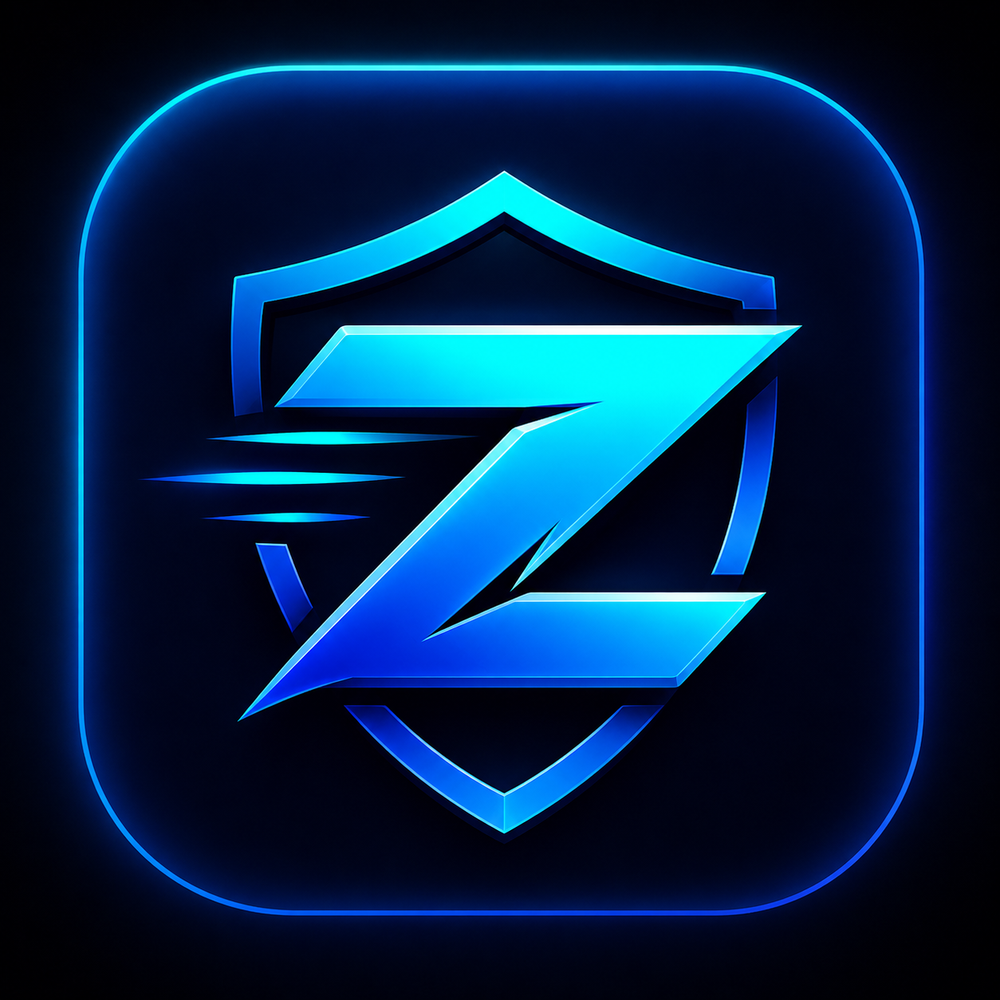
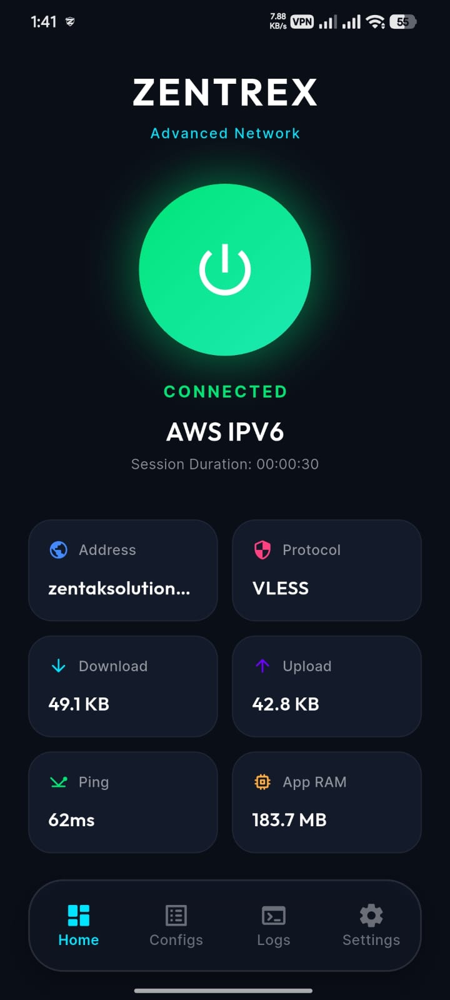
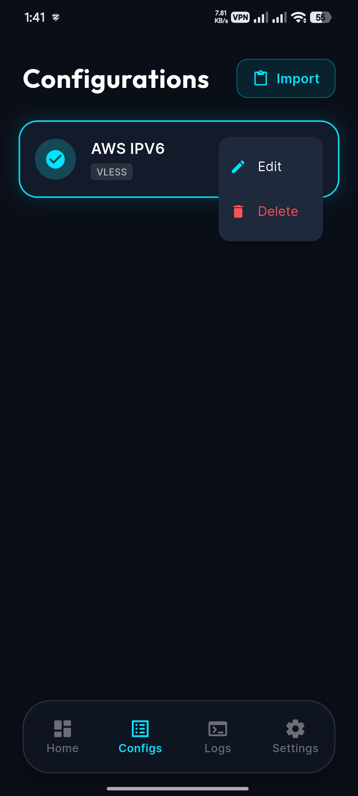
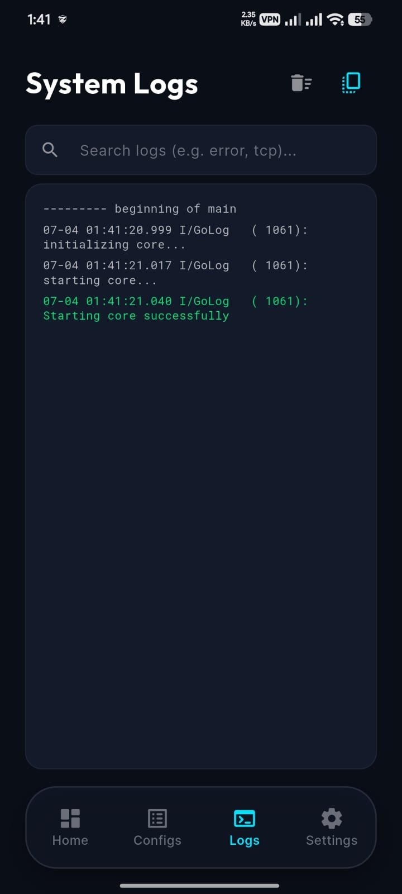
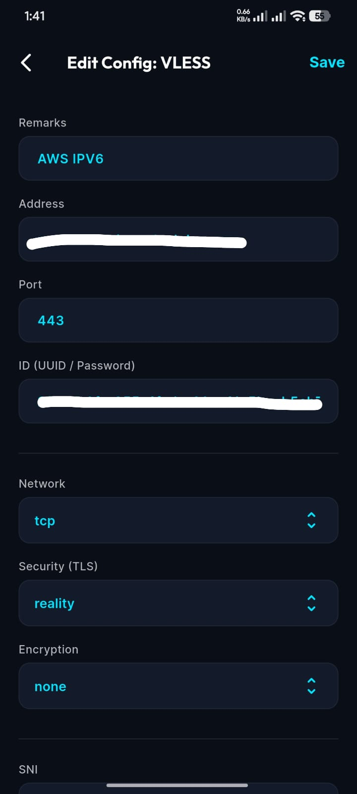

<div align="center">
  
  <h1>ZENTREX</h1>
  <p><strong>A Modern VPN & Network Analytics Application</strong></p>

  <p>
    <a href="https://flutter.dev"></a>
    <a href="https://dart.dev"></a>
    <a href="#"></a>
    <a href="#"></a>
  </p>
</div>

---

## 🚀 Overview
**ZENTREX** is a highly optimized, beautifully designed VPN and Network Analytics application built with Flutter. Utilizing the power of the `flutter_v2ray_client`, ZENTREX delivers top-tier proxy and VPN capabilities combined with stunning, real-time network analytics.

## 📱 Screenshots
<div align="center">
  
  &nbsp;&nbsp;&nbsp;&nbsp;
  
  <br/><br/>
  
  &nbsp;&nbsp;&nbsp;&nbsp;
  
</div>

## ✨ Features
- 🛡️ **Advanced VPN Core**: Powered by Xray/V2Ray protocols for secure, untraceable, and fast connections.
- 📊 **Real-time Analytics**: Built-in interactive charts (using `fl_chart`) to monitor upload/download speeds and network health.
- 📜 **Live System Logs**: Real-time V2Ray logging with syntax highlighting, search filtering, and smart auto-stop on connection success.
- ⚙️ **Config Management**: Seamlessly add, edit, and manage multiple V2Ray configurations.
- 🔒 **Safe Editing**: Built-in protection against modifying or deleting configs while an active VPN connection is established.
- 🎛️ **Advanced Editor**: Dive deep into proxy settings with the Advanced Edit Screen for power users.
- 🎨 **Modern UI/UX**: Sleek, dark-mode native design optimized for readability and ease of use.
- ⚡ **Instant Launch**: Highly optimized startup sequence bypassing loading screens for a zero-latency launch.
- 💾 **Local Storage**: Securely save configurations locally using `shared_preferences`.


## 🛠️ Tech Stack
* **Framework**: [Flutter](https://flutter.dev/)
* **Language**: [Dart](https://dart.dev/)
* **VPN Core**: `flutter_v2ray_client` (V2Ray/Xray integration)
* **Charts & Analytics**: `fl_chart`
* **Local Storage**: `shared_preferences`
* **Styling**: `google_fonts`

## 🏁 Getting Started

### Prerequisites
- [Flutter SDK](https://docs.flutter.dev/get-started/install) (`>= 3.0.0`)
- Android Studio / Xcode for platform-specific builds.

### Installation
1. Clone the repository:
   ```bash
   git clone https://github.com/your-username/zentrex.git
   cd zentrex
   ```
2. Fetch dependencies:
   ```bash
   flutter pub get
   ```
3. Run the application:
   ```bash
   flutter run
   ```

## 🤝 Contributing
Contributions are what make the open source community such an amazing place to learn, inspire, and create. Any contributions you make are **greatly appreciated**.

If you have a suggestion that would make this better, please fork the repo and create a pull request. You can also simply open an issue with the tag "enhancement".
1. Fork the Project
2. Create your Feature Branch (`git checkout -b feature/AmazingFeature`)
3. Commit your Changes (`git commit -m 'Add some AmazingFeature'`)
4. Push to the Branch (`git push origin feature/AmazingFeature`)
5. Open a Pull Request

## 🔐 Security
Sensitive files such as keystores, `.env` variables, and Firebase configurations (`google-services.json`, `GoogleService-Info.plist`) are safely ignored via `.gitignore` to prevent data leaks.

## 📄 License
This project is licensed under the [MIT License](LICENSE) - see the [LICENSE](LICENSE) file for details.
